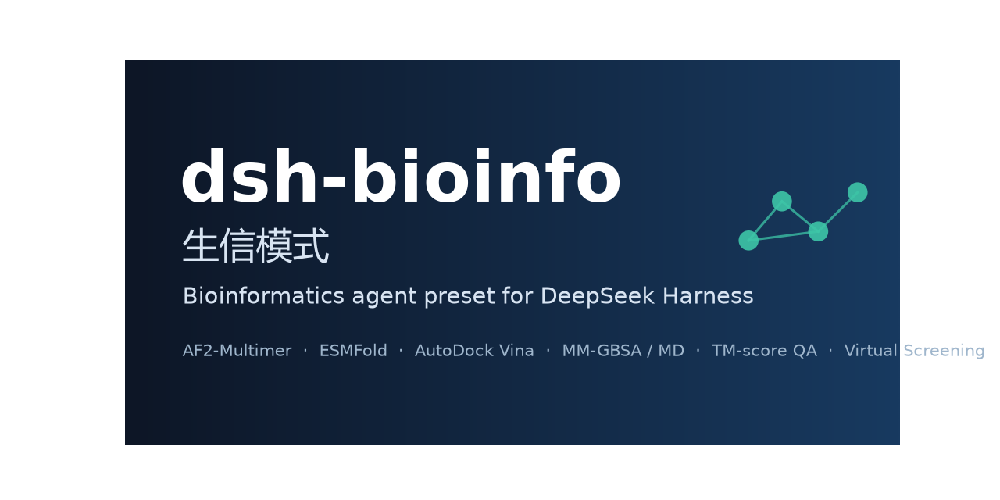

<p align="center">
  
</p>

[](https://github.com/Paraso42/dsh-bioinfo/actions/workflows/ci.yml)
[](LICENSE)
[](#platform-notes)

# dsh-bioinfo

**生信模式 (Bioinformatics Mode)** — a complete, research-grade bioinformatics
agent preset for [DeepSeek Harness (DSH)](https://www.npmjs.com/package/@deepseek-ai/dsh),
published as a replicable preset kit.

One repository carries everything needed to rebuild, on your own DSH instance,
the exact preset this project was developed and acceptance-tested on: preset
identity, agent composition + persona, the `protein-tools` plugin (7 model
tools), a 7-skill library with 14 backend scripts, deployment scripts, and a
small acceptance-fixture kit that proves your replica behaves like the
reference machine.

## What you get

| Layer | Contents |
|---|---|
| Preset | `preset.yml`, `agent.cordis.yml` (persona + standard agent rows + local plugin row) |
| Plugin | `plugins/protein-tools.js` — `esmfold_predict` / `pp_interact` / `vina_dock` / `af2_predict` / `struct_eval` / `vscreen_run` / `md_run` |
| Skills | `skills/` — biopython, biopython-analyses, protein-modeling, protein-quality, chem-informatics, bio-data-hub, bio-visualization (+ 14 resource scripts) |
| Deploy | `deploy/` — WSL2 LocalColabFold bootstrap, AF2 params download (GCS, 8-way ranged), parallel downloader, acceptance runner |
| Fixtures | `fixtures/acceptance/` — small positive controls (PDB/CSV/JSON/PNG, ~3.3 MB) |

## Quick start

1. **Install DSH** — `npm install -g @deepseek-ai/dsh` (see upstream docs).
2. **Deploy the environment** — follow [`docs/INSTALL.md`](docs/INSTALL.md):
   Python 3.13 + `D:\biopython` (Biopython 1.87), the `D:\bioai` toolchain
   (venv with RDKit/meeko/OpenMM, venv-esm with torch/fair-esm, the Vina
   binary, WSL2 LocalColabFold, AF2 params).
3. **Mount the preset** — copy `preset.yml`, `agent.cordis.yml`, `plugins/`,
   `skills/` into `<DSH_HOME>/.agent-presets/bioinfo/`, then start a session
   with the 生信模式 preset.
4. **Prove the replica** — run `deploy/run-acceptance.ps1` and
   `scripts/verify-layout.ps1`; compare against the reference values in
   [`fixtures/README.md`](fixtures/README.md).
5. **Remember the restart rule** — the preset composition is mounted once per
   DSH host process. After editing any preset file (`agent.cordis.yml`,
   `plugins/`, `skills/`), restart the DSH host; a new session alone is not
   enough (symptom: `Invalid schema ... got 'type: null'` at conversation
   start while the on-disk file is already fixed).

The reference layout below is part of the contract: a user deploying exactly
per `docs/INSTALL.md` gets an identical preset with zero file edits. Every
hard-coded path is also overridable via environment variables for those who
deviate.

## Configuration (plugin)

| Variable | Default |
|---|---|
| `BIO_TOOLS_PYTHON` | `C:\Program Files\Python313\python.exe` |
| `BIO_TOOLS_VENV_PY` | `D:\bioai\venv\Scripts\python.exe` |
| `BIO_TOOLS_RES_DIR` | `<preset>\skills\protein-modeling\resources` |
| `BIO_TOOLS_RES_PQ_DIR` | `<preset>\skills\protein-quality\resources` |
| `BIO_TOOLS_RES_CI_DIR` | `<preset>\skills\chem-informatics\resources` |
| `BIO_TOOLS_JOBS_DIR` | `D:\bioai\jobs` |
| `BIO_TOOLS_BIOPYTHON` | `D:\biopython` |

## Platform notes

- **Windows + PowerShell.** Every tool command is pwsh; a Linux/bash backend
  does not exist yet (contributions welcome).
- `af2_predict` needs WSL2 + an NVIDIA GPU for practical runtimes; CPU works
  but is slow — `esmfold_predict` is the zero-setup cloud alternative, but the
  ESM Atlas has been intermittently down (repeated 504s, 2026-08), so treat it
  as a fallback; offline fallback is `af2_predict` with `msaMode: "single_sequence"`.

## Known upstream issue (tool schema compilation)

Raw preset file-plugins receive the unsandboxed `ctx`, whose
`ctx.tools.register` stores definitions verbatim and lets the model layer
project `definition.parameters` straight to the API. A flat per-property map
therefore reaches the API without a root `type: "object"` and gets rejected
(`Invalid schema ... got 'type: null'`). The plugin registers through
`defineToolDef()`: sandboxed loads go through `harness.defineTool(...)`, raw
loads hand-compile `{type:'object', properties, required}` — the same shape
dsh-tools emits. **New tools must keep using this wrapper.**

## Tests

```
npm test                        # node --check + schema validator (cross-platform)
scripts/verify-layout.ps1       # self-consistency of an installed replica
deploy/run-acceptance.ps1       # end-to-end AF2-Multimer acceptance
```

Release history and user-facing update notices: [CHANGELOG.md](CHANGELOG.md).

## License

Repository code: MIT ([LICENSE](LICENSE)). Backend toolchain licensing —
including ACADEMIC-ONLY components (TM-align/TMalign, PRODIGY, local ESMFold
weights) — is itemized in [THIRD_PARTY_NOTICES.md](THIRD_PARTY_NOTICES.md).

## Contributing & security

Contributions welcome — see [CONTRIBUTING.md](CONTRIBUTING.md) (tool/backend
rules) and [CODE_OF_CONDUCT.md](CODE_OF_CONDUCT.md). Report vulnerabilities
privately via GitHub security advisories ([SECURITY.md](SECURITY.md)).

Real-world usage feedback and its disposition (fixed / documented / backlog)
is tracked in [FEEDBACK.md](FEEDBACK.md).
